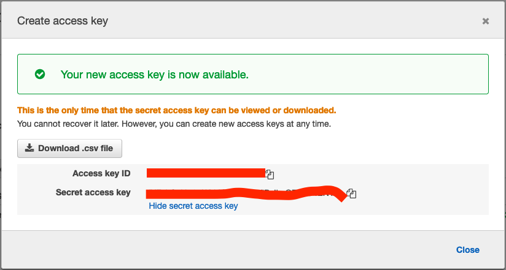

# tce-kcd-workshop

## Step 1: Install TCE

Latest TCE version as this writing is `v0.11.0`

Installation instructions:

- [TLDR; Manual installation](#tldr-manual-installation)
- [MacOS](#macos)
  - [Install with Homebrew](#install-with-homebrew-brew)
  - [Install with tar ball manually](#install-with-tar-ball-manually)
- [Linux](#linux)
  - [Install with Homebrew](#install-with-homebrew-brew-1)
  - [Install with tar ball manually](#install-with-tar-ball-manually-1)
- [Windows](#windows)
  - [Install with Chocolatey](#install-with-chocolatey)
  - [Install with zip manually](#install-with-zip-manually)

We are skipping installation from TCE source code as that takes quiet some time

### TLDR; Manual installation

Manual installation on Mac/Linux/Windows

- Download the release tarball based on your operating system.
- Unpack the release tarball.
  - Unzip on Windows.
  - `tar zxvf <release-tarball-path>` on Mac/Linux.
  - Enter the directory of the unpacked release.
  - Run the install script.
    - `.\install.bat` on Windows as Administrator.
    - `./install.sh` on Mac/Linux

### MacOS

#### Install with Homebrew (`brew`)

Ensure [Homebrew](https://brew.sh/) is installed

```bash
brew install vmware-tanzu/tanzu/tanzu-community-edition

${HOMEBREW_EXEC_DIR}/configure-tce.sh
```

#### Install with tar ball manually

```bash
# download the tar ball with your favorite browser or something like wget or curl
wget https://github.com/vmware-tanzu/community-edition/releases/download/v0.11.0/tce-darwin-amd64-v0.11.0.tar.gz

# extract the tar ball using Finder or a CLI tool like tar
tar xvzf tce-darwin-amd64-v0.11.0.tar.gz

# cd into the extracted directory
cd tce-darwin-amd64-v0.11.0

# run install.sh
./install.sh
```

### Linux

#### Install with Homebrew (`brew`)

Ensure [Homebrew](https://brew.sh/) is installed

```bash
brew install vmware-tanzu/tanzu/tanzu-community-edition

${HOMEBREW_EXEC_DIR}/configure-tce.sh
```

#### Install with tar ball manually

```bash
# download the tar ball with your favorite browser or something like wget or curl
wget https://github.com/vmware-tanzu/community-edition/releases/download/v0.11.0/tce-linux-amd64-v0.11.0.tar.gz

# extract the tar ball using Finder or a CLI tool like tar
tar xvzf tce-linux-amd64-v0.11.0.tar.gz

# cd into the extracted directory
cd tce-linux-amd64-v0.11.0

# run install.sh
./install.sh
```

### Windows

#### Install with Chocolatey

```
choco install tanzu-community-edition --version 0.11.0
```

#### Install with zip manually

Download the zip with your favorite browser or something like `Invoke-WebRequest` or `wget` or `curl` etc

Link - https://github.com/vmware-tanzu/community-edition/releases/download/v0.11.0/tce-windows-amd64-v0.11.0.zip

```
$source = 'https://github.com/vmware-tanzu/community-edition/releases/download/v0.11.0/tce-windows-amd64-v0.11.0.zip'
$destination = '<destination-path>\tce-windows-amd64-v0.11.0.zip'
Invoke-WebRequest -Uri $source -OutFile $destination
```

Then extract the zip file using File explorer or something like `Expand-Archive`

```
Expand-Archive -LiteralPath "<destination-path>\tce-windows-amd64-v0.11.0.zip" -Destination '<destination-path-for-extracted-directory>'
```

Change directory into the extracted directory

```
cd <destination-path-for-extracted-directory>\tce-windows-amd64-v0.11.0
```

Run `install.bat` script

```
.\install.bat
```

## Step 2: Prep for installing Management Cluster

- Login to AWS Console
- Click on the profile name on top right
- Select `Security Credentials`


- Create access key




- Run `aws configure` to configure your AWS credentials that you just got and also configure the default region. For example set region to something like `us-east-1`

```bash
$ aws configure
AWS Access Key ID [***************]:
AWS Secret Access Key [****************]:
Default region name [us-east-1]:
Default output format [None]:
```

## Step 3: Create the Management Cluster

We will be using the Kickstart Web UI to create our cluster

```bash
tanzu management-cluster create --ui
```

## Step 4: Get Management Cluster details

```
tanzu management-cluster get
```

It's kind of a wrapper around `clusterctl`

## Step 5: Get Management Cluster Admin Kubeconfig

```
tanzu management-cluster kubeconfig get --admin
```

## Step 6: Switch Kubernetes context to the Management Cluster in the Kubeconfig

```
kubectl config use-context tce-aws-demo-admin@tce-azure-demo
```

## Step 7: Connect to Management Cluster and check it out

```
kubectl version

kubectl get nodes

kubectl get pods -A
```

## Step 8: Checkout the AWS resources created for the Management Cluster in the AWS Console

## Step 9: Create Workload Cluster

```
tanzu cluster create tce-aws-demo-wkld -f <cluster-config-yaml-file>
```

## Step 10: Get Workload Cluster Admin Kubeconfig

```
tanzu cluster kubeconfig get tce-aws-demo-wkld --admin
```

## Step 11: Switch Kubernetes context to the Workload Cluster in the Kubeconfig

```
kubectl config use-context tce-aws-demo-wkld-admin@tce-aws-demo-wkld
```

## Step 12: Connect to Workload Cluster and check it out

```
kubectl version

kubectl get nodes

kubectl get pods -A
```

## Step 13: Checkout the AWS resources created for the Workload Cluster in the AWS Console
